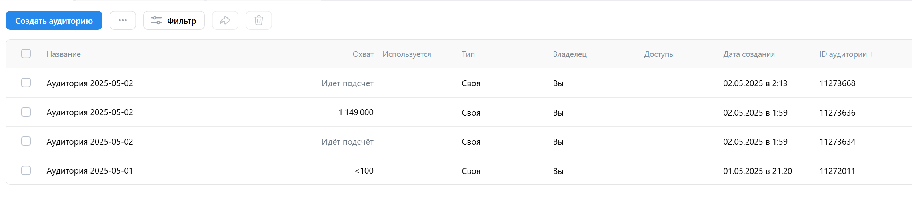

# ДЗ3 команды FullStack-Overflow

## Тестируется [ads.vk.com](https://ads.vk.com/)

Окружение: Google Chrome версия 136.0.7103.49 (Официальная сборка), (64 бит) для Windows

## Аккаунт Партнера

### Статистика

### Сайт (с рекламными блоками)

### Мобильное приложение

(Не тестировался так как нет мобильного приложения)

## Аккаунт Рекламодателя

### Сайт

#### Общее для раздела

(Требуется зарегистрироваться как рекламодатель)

* [ ] Сайты. Добавить пиксель. Добавление по домену. Проверить, что предложат получить код. Проверить, что выведет id. Проверить, что сайт добавился в список.  

* [ ] Сайты. Переименовать пиксель. Переименовать пиксель. Проверить изменение имени в списке.
* [ ] Сайты. Переименовать пиксель. Переименовать пиксель введя 255+ символов. Проверить появление "Внутрення ошибка сервера"  

* [ ] Сайты. Удалить пиксель. Удалить существующий пиксель. Проверить, что этот пиксель удалился из списка.  

* [ ] Сайты. Код пикселя. Включить Сбор событий из слоя данных (data-layer). Поменять название слоя данных на "abc". Проверить изменение в коде пикселя в поле "ecommerce:"  
* [ ] Сайты. Код пикселя. Включить Сбор событий из слоя данных (data-layer). Поменять название слоя данных на "ффф". Проверить получение ошибки "Недопустимое значение переменной. Используйте только буквы, цифры и символы $, _"  

* [ ] Сайты. Код пикселя. Включить Сбор событий из слоя данных (data-layer). Поменять название слоя данных введя более 255 символов "a". Проверить получение ошибки "Внутренняя ошибка сервера"  

* [ ] Сайты. События. Добавить событие. Выбрать создание вручную. Заполнить поля и указать ценность. Проверить, что событие появилось.  

* [ ] Сайты. Аудиторные теги. Создать тег. Проверить, что он появился в списке. Проверить код аудиторного тега.  

* [ ] Сайты. Доступы. Добавить доступ. Проверить получение доступа в списке.  

* [ ] Сайты. Доступы. Закрыть доступ. Проверить исчезновение доступа из списка.  

### Мобильное приложение

(Не тестировался так как нет мобильного приложения)

### Лидформы и опросы

### Компании

### Аудитории

* [ ] Аудитории. Загрузить список. Создать новый. Выбрать тип списка "Единый список" и прикрепив файл "files/union_list.csv", сняв галочку "Создать новую аудиторию". Проверить появление нового списка.  

* [ ] Аудитории. Удалить список. Проверить, что список удалился.  

* [ ] Аудитории. Загрузить список. Добавить в существующий. Выбрать "Существующий список" и прикрепив файл "files/generated_data_250.csv". Проверить, что количество идентификаторов в поле статус увеличилось.  

* [ ] Аудитории. Загрузить список. Исключить из существующего. Выбрать "Существующий список" и прикрепив файл "files/generated_data_250.csv". Проверить, что количество идентификаторов в поле статус уменьшилось.  

* [ ] Аудитории. Создать аудиторию. Добавить источник. Выбрать "Загрузить список пользователей" прикрепив файл "files/generated_data_250.csv". Проверить, что новая аудитория отобразилась в списке.  

* [ ] Аудитории. Создать аудиторию. Исключить источник. Выбрать "Загрузить список пользователей" прикрепив файл "files/generated_data_250.csv". Проверить, что новая аудитория отобразилась в списке.  

* [ ] Аудитории. Удалить аудиторию. Проверить, что аудитория удалилась.  

* [ ] Аудитории. Создать аудиторию. Добавить источник. Выбрать "Уже созданная аудитория". Проверить, что новая аудитория отобразилась в списке.  

* [ ] Аудитории. Создать аудиторию. Добавить источник. Выбрать "События в моих объявлениях". Проверить, что новая аудитория отобразилась в списке.  

* [ ] Аудитории. Создать аудиторию. Добавить источник. Выбрать "Категории мобильного приложения". Проверить, что новая аудитория отобразилась в списке.  

* [ ] Аудитории. Создать аудиторию. Добавить источник. Выбрать "События в лид форме", добавить "Открытия формы". Проверить, что новая аудитория отобразилась в списке.  

* [ ] Аудитории. Создать аудиторию. Добавить источник. Выбрать "Вводили ключевые фразы", ввести ключевую фразу. Проверить, что новая аудитория отобразилась в списке.  

* [ ] Аудитории. Создать аудиторию. Добавить источник. Выбрать "Подписчики сообществ", ввести название сообщества. Проверить, что новая аудитория отобразилась в списке.  

* [ ] Аудитории. Создать аудиторию. Добавить источник. Выбрать "Слушатели музыкантов", ввести имя музыканта. Проверить, что новая аудитория отобразилась в списке.  

* [ ] Аудитории. Создать аудиторию. Добавить источник. Выбрать "Пользуются VK Mini Apps или играют ВКонтакте", ввести название игры. Проверить, что новая аудитория отобразилась в списке.  

* [ ] Аудитории. Создать офлайн конверсии. Загрузить список. Создать новый. Выбрать тип "телефонные номера" загрузить файл "files/conversion_users_plain_phones.csv". Проверить, что он появился в списке офлайн-конверсий.  

* [ ] Аудитории. Создать офлайн конверсии. Загрузить список. Добавит в существующий. Выбрать тип "телефонные номера" загрузить файл "files/conversion_users_plain_phones.csv". Проверить изменение поля "Всего пользователей".  

## Аккаунт Агентства

(Не тестировался так как требует юрлица)
