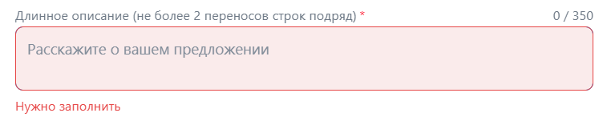

# ДЗ3 команды FullStack-Overflow

## Тестируется [ads.vk.com](https://ads.vk.com/)

## Оглавление

<!-- mtoc-start -->

* [Аккаунт Партнера](#аккаунт-партнера)
  * [Мобильное приложение](#мобильное-приложение)
  * [Сайт](#сайт)
    * [Добавить сайт](#добавить-сайт)
    * [Страница сайта](#страница-сайта)
    * [Страница сайтов](#страница-сайтов)
  * [Рекламные блоки](#рекламные-блоки)
    * [Добавить блок](#добавить-блок)
    * [Страница рекламного блока](#страница-рекламного-блока)
    * [Страница рекламных блоков](#страница-рекламных-блоков)
  * [Статистика](#статистика)
* [Аккаунт Рекламодателя](#аккаунт-рекламодателя)
  * [Сайт](#сайт-1)
    * [Общее для раздела](#общее-для-раздела)
  * [Мобильное приложение](#мобильное-приложение-1)
  * [Лидформы и опросы](#лидформы-и-опросы)
    * [Создание лид-формы](#создание-лид-формы)
  * [Кампании](#кампании)
  * [Аудитории](#аудитории)
* [Аккаунт Агентства](#аккаунт-агентства)

<!-- mtoc-end -->

## Аккаунт Партнера

### Мобильное приложение

(Не тестировался так как нет мобильного приложения)

### Сайт

#### Добавить сайт

URL: [https://ads.vk.com/hq/partner/sites](https://ads.vk.com/hq/partner/sites)

* [ ] В поле "Ссылка на сайт" указать несуществующий сайт (uart.si). Проверить, что инпут выделится красным и появится ошибка "Ссылка должна указывать на действующий сайт". Проверить, что кнопка "Добавить сайт" неактивна.

* [ ] Поле "Название сайта" оставить пустым. Проверить, что инпут выделится красным и появится ошибка "Не может быть пустым". Проверить, что кнопка "Добавить сайт" неактивна.

* [ ] Ввести в поле "Название сайта" более 200 символов. Проверить, что инпут выделится красным и появится ошибка "Название не должно превышать 200 символов". Проверить, что кнопка "Добавить сайт" неактивна.

* [ ] Корректно заполнить форму (сайт: uart.site с тем же именем). Проверить, что в форме отобразился favicon добавленного сайта. Нажать кнопку "Добавить сайт". Проверить, что сайт создался и произошел редирект на страницу созданного сайта. Проверить, что на странице сайтов [https://ads.vk.com/hq/partner/sites](https://ads.vk.com/hq/partner/sites) появился созданный сайт.

Удалить сайт после добавления нельзя. При повторе теста с теми же параметрами создастся такой же сайт с новым ID.

#### Страница сайта

Предварительные требования: наличие созданного сайта.

* [ ] Изменение имени сайта. Поменять имя сайта на любое ("best-page"). Проверить, что после обновления страницы имя осталось измененным.

* [ ] Изменение имени сайта. Проверить, что нельзя изменить имя на пустое (кнопка-галочка должна быть неактивной)

* [ ] Изменение имени сайта. Проверить, что нельзя изменить имя на строку более 200 символов. Проверить, что при превышении 200 символов инпут выделится красным и появится сообщение об ошибке "Название не должно превышать 200 символов".

Дополнительные предварительные требования: наличие не менее двух созданных сайтов.

* [ ] Выпадающий список сайтов. Проверить, что выбор другого сайта в выпадающем списке редиректит на страницу соответствующего сайта.

<!-- TODO: Настройки сайта -->

#### Страница сайтов

URL: [https://ads.vk.com/hq/partner/sites](https://ads.vk.com/hq/partner/sites)

Предварительные требования: наличие созданного сайта.

* [ ] Смена статуса сайта. Выбрать один из сайтов и сменить ему статус на "Остановлено", выбрав действие "Остановить" из выпадающего списка. Проверить, что статус стал соответствующим.

Дополнительные предварительные требования: наличие не менее двух созданных сайтов.

* [ ] Фильтрация. Выбрать одному сайту статус "Остановлено". Отфильтровать сайты по статусу "Остановлено". Проверить, что фильтрация произошла корректно и отображаются только сайты со статусом "Остановлено". Проверить наличие оповещения о включенном фильтре над списком сайтов.

* [ ] Поиск. Ввести название существующего сайта из списка сайтов. Проверить, что в списке после ввода отображаются только сайты с указанным именем или именами, для которых указанное имя является частью.

* [ ] Поиск. Ввести название несуществующего сайта из списка сайтов (например 234781273074dvhlalsjkljlkj). Проверить, что в списке после ввода отображается надпись "Ничего не нашлось"

### Рекламные блоки

Предварительные требования: наличие созданного сайта

#### Добавить блок

* [ ] Нажать на чекбокс "Сайт является AMP-страницей". Проверить, что остается один формат размещения "Дисплейный блок". Проверить, что отсутствует кнопка "Настроить дизайн". Проверить, что отсутствует radiogroup "Тип интеграции".

* [ ] Оставить поле "Название рекламного блока" пустым. Проверить, что инпут красный и присутствует ошибка "Не может быть пустым". Проверить, что кнопка "Создать" неактивна.

* [ ] Ввести в поле "Название рекламного блока" более 200 символов. Проверить, что инпут красный и присутствует ошибка "Название не должно превышать 200 символов". Проверить, что кнопка "Создать" неактивна.

* [ ] Ввести в поле "Название рекламного блока" корректное название (my first block). Проверить, что отсутствуют ошибки и инпут не имеет красный цвет.

* [ ] Выбрать тип блока "Рекомендательный виджет". Проверить, что пропал выбор размеров блока.

* [ ] Выбрать порог CPM вручную. Указать для произвольной страны CPM. Проверить, что любой ввод, кроме цифрового, игнорируется. Проверить, что нельзя указать больше 10000 руб.

* [ ] Выбрать порог CPM вручную. Указать для региона выбранной произвольной страны CPM, отличающийся от CPM страны. Проверить, что любой ввод, кроме цифрового, игнорируется. Проверить, что нельзя указать больше 10000 руб. Проверить, что CPM ранее выбранной страны не изменился.

* [ ] Выбрать порог CPM вручную. Отметить чекбокс "Только настроенные". Проверить, что отображаются только регионы и страны с указанным CPM.

* [ ] Выбрать порог CPM вручную. Заполнить поле "Общий порог CPM". Проверить, что нельзя ввести CPM более 10000 руб. Проверить, что любой нецифровой ввод игнорируется. Проверить, что ранее указанный CPM не изменился.

* [ ] Выбрать порог CPM вручную. В поле "Поиск по названию" ввести название любой существующей в списке страны. Проверить, что страна была найдена в списке. Проверить, что она также находится и для частичного ввода названия.

* [ ] Выбрать порог CPM вручную. В поле "Поиск по названию" ввести ввод, не являющийся частью названия какой-либо страны (например 123123123). Проверить, что список стран пропал.

* [ ] Настроить дизайн. Проверить, что для масштаба 100% размер дисплейного блока совпадает с размером, указанным в форме (240x400). Проверить, что для другого масштаба (40%) размер баннера пропорционально изменяется.

* [ ] Настроить дизайн дисплейного блока. Выбрать дизайн из примера. Проверить, что все элементы демо-баннера удовлетворяют дизайну. Пример дизайна:
    > * Цвет рамки #ff0000
    > * Цвет заголовка #00ff00
    > * Стиль ссылки при наведении #0000ff
    > * Шрифт заголовка баннера Verdana
    > * Подчёркивание -> ссылки подчеркиваются
    > * Цвет текста баннера #ffff00
    > * Шрифт текста баннера Tahoma
    > * Цвет фона кнопки баннера #00abf1
    > * Цвет текста кнопки баннера #ff00ff
    > * Шрифт текста кнопки Arial

* [ ] Создать рекламный блок для сайта формата "Дисплейный блок" с указанными параметрами. Проверить, что произошел редирект на страницу блока. Проверить совпадение порогов CPM, кода вызова своей рекламы и настроек частоты показов с указанными в форме. Проверить, что блок отображается на странице рекламных блоков [https://ads.vk.com/hq/partner/sites](https://ads.vk.com/hq/partner/sites) по его id.

    > * Название: "my first block"
    > * Формат размещения: "Дисплейный блок"
    > * Размер: "300x600"
    > * Настроить дизайн: как в примере выше для дисплейного блока
    > * Тип интеграции: Прямая
    > * Порог CPM: вручную
    > * Общий порог CPM: 20
    > * Порог для "Танзания": 200
    > * Порог для Европы: 10000
    > * Код вызова своей рекламы: "elelbobo"
    > * Лимит показов уникальному пользователю: 26
    > * За период: в неделю
    > * Интервал между показами: 24

* [ ] Создать рекламный блок для сайта с активным чекбоксом "Сайт является AMP-страницей" и указанными параметрами. Проверить, что произошел редирект на страницу нового блока. Проверить совпадение порогов CPM, кода вызова своей рекламы и настроек частоты показов с указанными в форме. Проверить, что блок отображается на странице рекламных блоков [https://ads.vk.com/hq/partner/sites](https://ads.vk.com/hq/partner/sites) по его id.

    > * Название: "my amp block"
    > * Формат размещения: "Дисплейный блок"
    > * Размер: "300x250"
    > * Порог CPM: вручную
    > * Общий порог CPM: 2
    > * Порог для "Россия": 400
    > * Порог для "Африки": 1000
    > * Код вызова своей рекламы: ""
    > * Лимит показов уникальному пользователю: 6
    > * За период: в месяц 
    > * Интервал между показами: 2

* [ ] Создать рекламный блок для сайта формата "Рекомендательный виджет" с указанными параметрами. Проверить, что произошел редирект на страницу нового блока. Проверить совпадение порогов CPM, кода вызова своей рекламы и настроек частоты показов с указанными в форме. Проверить, что блок отображается на странице рекламных блоков [https://ads.vk.com/hq/partner/sites](https://ads.vk.com/hq/partner/sites) по его id.

    > * Название: "Мой рекомендательный виджет"
    > * Формат: Рекомендательный виджет
    > * Порог CPM: Автоматический
    > * Лимит показова уникальному пользователю: без ограничений
    > * За период: в день
    > * Интервал между показами: без ограничений

Удалить рекламные блок также невозможно. Создание одинаковых блоков разрешено: блоки будут отличаться по id.

#### Страница рекламного блока

Предварительные требования: Наличие сайта с рекламным блоком на нем.

* [ ] Настройки. Включить тестовый режим. Нажать "Отменить". Проверить, что до и после обновления страницы тестовый режим неактивен.

* [ ] Настройки. Включить тестовый режим. Нажать "Сохранить". Проверить, что появилось уведомление "Изменения сохранены". Проверить, что после обновления страницы тестовый режим активен.

* [ ] Настройки. Порог CPM. Установить порог CPM для региона "Северная Америка" 100 руб. Нажать "Отменить". Проверить, что до и после обновления страницы порог для выбранного региона остался тем, каким и был.

* [ ] Настройки. Порог CPM. Установить порог CPM для региона "Северная Америка" 100 руб. Нажать "Сохранить". Проверить, что появилось уведомление "Изменения сохранены". Проверить, что после обновления страницы порог для выбранного региона стал 100 руб.

* [ ] Настройки. Код вызова своей рекламы. Указать произвольный код ("hello new code"). Нажать "Отменить". Проверить, что до и после обновления страницы код остался старым.

* [ ] Настройки. Код вызова своей рекламы. Указать произвольный код ("hello new code"). Нажать "Сохранить". Проверить, что появилось уведомление "Изменения сохранены". Проверить, что после обновления страницы остался новый код.

* [ ] Настройки. Частота показов. Переключить все dropdown элементы в соответсвии с указаниями ниже. Нажать "Отменить". Проверить, что до и после обновления страницы выбранные значения остались неизменненными.
    > Лимит показов уникальному пользователю: 11
    > За период: в неделю
    > Интервал между показами: 29

* [ ] Настройки. Частота показов. Переключить все dropdown элементы в соответсвии с указаниями выше. Нажать "Сохранить". Проверить, что появилось уведомление "Изменения сохранены". Проверить, что после обновления страницы выбранные значения сохранились.

* [ ] Настройки. Код вызова своей рекламы. Указать произвольный текст и сохранить. Проверить, что после обновления страницы код остался сохраненным.

* [ ] Изменение имени блока. Оставить поле пустым. Проверить, что кнопка-галочка неактивна.

* [ ] Изменение имени блока. Ввести более 200 символов. Проверить, что инпут красный и присутствует ошибка "Название не должно превышать 200 символов".

* [ ] Изменение имени блока. Ввести в поле корректное название (renamed block). Нажать на кнопку-галочку. Обновить страницу. Проверить, что новое название сохранилось.

* [ ] Код для метчинга. Нажать кнопку "Получить код". Проверить, что отобразилось окно "Код для установки на сайт". Проверить, что в окне присутствует код на JS (по наличию textarea с html тегом "script"). Проверить, что при нажатии на кнопку "Скопировать код" он попадет в буфер обмена.

#### Страница рекламных блоков

Предварительные требования: Наличие сайта с рекламным блоком.

URL: https://ads.vk.com/hq/partner/sites/<ID сайта>/blocks

* [ ] Смена статуса блока. Выбрать один из блоков и сменить ему статус на "Остановлено", выбрав действие "Остановить" из выпадающего списка. Проверить, что статус стал соответствующим.

Дополнительные предварительные требования: наличие не менее двух созданных сайтов.

* [ ] Фильтрация. Выбрать одному блоку статус "Остановлено". Отфильтровать блоки по статусу "Остановлено". Проверить, что фильтрация произошла корректно: отображаются только блоки со статусом "Остановлено". Проверить наличие оповещения о включенном фильтре над списком блоков.

* [ ] Поиск. Ввести название существующего блока из списка блоков. Проверить, что в списке после ввода отображаются только блоки с указанным именем или именами, для которых указанное имя является частью.

* [ ] Поиск. Ввести название существующего сайта из списка блоков. Проверить, что в списке после ввода отображаются только блоки сайт которых имеет указанное имя или имя, для которых указанное имя является частью.

* [ ] Поиск. Ввести название несуществующего блока из списка блоков (например 234781273074dvhlalsjkljlkj). Проверить, что в списке после ввода отображается надпись "Ничего не нашлось"

* [ ] Дубликация блока. Нажать на кнопку "Создать дубликат". В появившемся окне нажать кнопку "Дублировать". Проверить, что произошел редирект на страницу дубликата. Проверить (по id), что дубликат находится в списке блоков.

### Статистика

Данный раздел не тестируется, так как необходимо, чтобы была размещена реклама на сайте и находилась
на нем некоторое время, чтобы накопилась статистика. В противном случае (то есть нашем) раздел нефункциональный.

## Аккаунт Рекламодателя

### Сайт

#### Общее для раздела

(Требуется зарегистрироваться как рекламодатель)

* [ ] Сайты. Добавить пиксель. Добавление по домену. Проверить, что предложат получить код. Проверить, что выведет id. Проверить, что сайт добавился в список.  

* [ ] Сайты. Переименовать пиксель. Проверить изменение имени в списке.
* [ ] Сайты. Переименовать пиксель введя 255+ символов. Проверить появление "Внутрення ошибка сервера"  

* [ ] Сайты. Код пикселя. Включить Сбор событий из слоя данных (data-layer). Поменять название слоя данных на "abc". Проверить изменение в коде пикселя в поле "ecommerce:"  
* [ ] Сайты. Код пикселя. Включить Сбор событий из слоя данных (data-layer). Поменять название слоя данных на "ффф". Проверить получение ошибки "Недопустимое значение переменной. Используйте только буквы, цифры и символы $, _"  

* [ ] Сайты. Код пикселя. Включить Сбор событий из слоя данных (data-layer). Поменять название слоя данных введя более 255 символов "a". Проверить получение ошибки "Внутренняя ошибка сервера"  

* [ ] Сайты. События. Добавить событие. Выбрать создание вручную. Заполнить поля и указать ценность. Проверить, что событие появилось.  

* [ ] Сайты. Аудиторные теги. Создать тег. Проверить, что он появился в списке. Проверить код аудиторного тега.  

* [ ] Сайты. Доступы. Добавить доступ. Проверить получение доступа в списке.  

* [ ] Сайты. Доступы. Закрыть доступ. Проверить исчезновение доступа из списка.  
* [ ] Сайты. Удалить пиксель. Удалить существующий пиксель. Проверить, что этот пиксель удалился из списка.  

### Мобильное приложение

(Не тестировался так как нет мобильного приложения)

### Лидформы и опросы

#### Создание лид-формы

* [ ] Создание лид-формы. Ввести длинное название. Проверить, что форма с полем "Название лид-формы" с более чем 256 символами не сохраняется.

* [ ] Создание лид-формы. Оставить поле "Название" пустым. Проверить, что форму без названия создать нельзя.

* [ ] Создание лид-формы. Переключить toggle "Создать лендинг". Проверить, что лендинг не существует и отображается сообщение "Необходимо создать лендинг".

* [ ] Создание лид-формыю. Toggle "Создать лендинг" активен. Нажать кнопку "Редактировать". Проверить, что открылась форма "Конструктор лендинга"

* [ ] Создание лид-формы. Конструктор лендинга. Переключить вариант лендинга с "Мобайл" на "Десктоп". Проверить, что изменился размер карточки.

* [ ] Создание лид-формы. Конструктор лендинга. В поле "Название компании" ввести длинное название. Проверить, что ввод текста после 30-го символа игнорируется.  

* [ ] Создание лид-формы. Конструктор лендинга. Оставить поле "Название компании" пустым. Проверить, что форму создать нельзя - кнопка "Сохранить" неактивна.

* [ ] Создание лид-формы. Конструктор лендинга. В поле "Введите заголовок" ввести длинное название. Проверить, что текст обрежется после 70-го символа.

* [ ] Создание лид-формы. Конструктор лендинга. Оставить поле "Название компании" пустым. Проверить, что форму создать нельзя - кнопка "Сохранить" неактивна.

* [ ] Создание лид-формы. Конструктор лендинга. Нажать на кнопку "Добавить блок" и выбрать "Текст". Проверить, что добавляется поле "Введите текст".
 

* [ ] Создание лид-формы. Конструктор лендинга. Ввести в поле "Введите текст" очень длинное название. Проверить, что текст длинной более 2000 символов обрежется.

* [ ] Создание лид-формы. Конструктор лендинга. Оставить поле "Введите текст" пустым. Проверить, что форму создать нельзя - кнопка "Сохранить" неактивна.

* [ ] Создание лид-формы. Конструктор лендинга. Нажать на иконку. Проверить, что откроется форма для загрузки изображений.

* [ ] Создание лид-формы. Конструктор лендинга. Форма загрузки изображений. Добавить изображение формата jpg и размером не более 5 МБ. Проверить, что изображение появилось в разделе "Изображения"  

* [ ] Создание лид-формы. Конструктор лендинга. Нажать на кнопку "Сохранить". Проверить, что на странице создания лид-формы  применен созданный лендинг.  

* [ ] Создание лид-формы. Отлючить toggle "Создать лендинг". Проверить, что во включенном состоянии вводить "Название компании" и логотип не нужно, а в выключенном применяется название компании из лендинга.

* [ ] Создание лид-формы. Оставить инпут логотипа пустым. Проверить, что без загрузки логотипа нельзя перейти к следующему этапу заполнения лид-формы.  

* [ ] Создание лид-формы. Загрузить логотип. Проверить, что можно перейти к следующему этапу заполнения формы.

* [ ] Создание лид-формы. Оставить название организации пустым. Проверить, что при нажатии на кнопку "Далее" поле ввода укажет на наличие ошибки.

* [ ] Создание лид-формы. Оставить название организации слишком большой длины. Проверить, что при нажатии на кнопку "Далее" поле ввода укажет на наличие ошибки.

* [ ] Создание лид-формы. Оставить заголовок пустым. Проверить, что при нажатии на кнопку "Далее" поле ввода укажет на наличие ошибки.

* [ ] Создание лид-формы. Оставить заголовок слишком большой длины. Проверить, что при нажатии на кнопку "Далее" поле ввода укажет на наличие ошибки.

* [ ] Создание лид-формы. Оставить описание формы пустым. Проверить, что при нажатии на кнопку "Далее" поле ввода укажет на наличие ошибки.

* [ ] Создание лид-формы. Сделать описание формы большой длины. Проверить, что при нажатии на кнопку "Далее" поле ввода укажет на наличие ошибки.
 

* [ ] Создание лид-формы. Выбрать стиль произвольного цвета. Проверить, что стиль карточки изменится соответствующим образом  
  

* [ ] Создание лид-формы. Загрузить изображение обложки формата jpg. Проверить, что изображение появилось в шапке карточки.  

* [ ] Создание лид-формы. Нажать на кнопку "Больше текста". Проверить, что отобразиться поле "Длинное описание"

* [ ] Создание лид-формы. Оставить поле "Длинное описание" пустым. Проверить, что перейти к следующему этапу заполнения формы нельзя.  

* [ ] Создание лид-формы. Оставить поле "Длинное описание" слишком длинным. Проверить, что перейти к следующему этапу заполнения формы нельзя.  

* [ ] Создание лид-формы. Использовать более 2 переносов строк в поле "Длинное описание". Проверить, что перейти к следующему этапу заполнения формы нельзя.  

* [ ] Создание лид-формы. Нажать на кнопку типа лид-формы "Лид-магнит". Проверить, что появятся поля "тип вознаграждения" и "размер скидки" с возможностью указать её в абсолютных и относительных величинах.

* [ ] Создание лид-формы. Установить скидку 0 или меньше. Проверить, что отобразиться сообщение "Значение должно быть больше нуля" и к следующему этапу заполнения формы перейти невозможно.  

* [ ] Создание лид-формы. Нажать на кнопку % в поле скидки и установить её значение более 100. Проверить, что нельзя установить скидку более 100%.  

* [ ] Создание лид-формы. Нажать на бонус в типе вознаграждения. Проверить, что появится текстовое поле "Описание бонуса".

* [ ] Создание лид-формы. Оставить поле "Описание бонуса" пустым. Проверить, что это поле будет подсвечено сообщением "Нужно заполнить".  

* [ ] Создание лид-формы. Оставить поле "Описание бонуса" слишком длинным. Проверить, что это поле будет подсвечено сообщением "Сократите текст" и сохранение формы невозожно.  

* [ ] Создание лид-формы. Нажать на кнопку "Продолжить". Проверить, что никаких предупреждений о том, что что-то заполнено некорректно нет и произошёл переход на этап "Вопросы".

* [ ] Создание лид-формы. Вкладка вопросов. Нажать кнопку "Добавить вопрос". Проверить, что создалась карточка с формой вопроса.

* [ ] Создание лид-формы. Вкладка вопросов. Ввести в поле "Напишите вопрос" текст. Проверить, что на превью лендинга отобразиться текст вопроса.

* [ ] Создание лид-формы. Вкладка вопроса. Ввести в доступные поля "Введите ответ" текст. Проверить, что на превью лендинга отобразиться варианты ответа с этим текстом.

* [ ] Создание лид-формы. Вкладка вопроса. Нажать на выпадающий список "Тип вопроса" и выбрать "Выбор нескольких ответов". Проверить, что на превью лендинга варианты ответов сменятся с radio-button на check-box.

* [ ] Создание лид-формы. Вкладка вопроса. Нажать на кнопку добавить ответ. Проверить, что появилось 1 поле для варианта ответа и появился значёк для удаления варианта ответа.

* [ ] Создание лид-формы. Вкладка вопроса. Нажать на крестик в поле варианта ответа. Проверить, что поле удалено.

* [ ] Создание лид-формы. Вкладка вопроса. Нажать на точки в левой части поля вопроса и удерживая поменять местами поля ввода. Проверить, что варианты ответа поменялись местами.  

* [ ] Создание лид-формы. Вкладка вопроса. Нажать на значок удаления вопроса (действие необратимо). Проверить, что вопрос удалён.  

* [ ] Создание лид-формы. Вкладка вопроса. Раздел контактной информации. Нажать на точки в левой части типа контакта и удерживая поменять местами. Проверить, что варианты ответа поменялись местами.

* [ ] Создание лид-формы. Вкладка вопроса. Раздел контактной информации. Нажать на кнопку удаления одного из типов контактной информации. Проеврить, что в лендинге не отображается удаленный тип контакта.  

* [ ] Создание лид-формы. Вкладка вопроса. Раздел контактной информации. Нажать на кнопку "Контактные данные" и выбрать один или несколько типов контактов. Проверить, что данные типы контактов добавились на лендинге и в разделе контактная информация.

* [ ] Создание лид-формы. Вкладка вопроса. Нажать на кнопку "Продолжить". Проверить, что осуществлен на вкладку "Результат".

* [ ] Создание лид-формы. Вкладка результата. Оставить поле "Заголовок" пустым. Проверить, что нельзя перейти к следующей вкладке.

* [ ] Создание лид-формы. Вкладка результата. Ввести в поле "Заголовок" больше 25 символов. Проверить, что нельзя перейти к следующему этапу.  

* [ ] Создание лид-формы. Вкладка результата. Заполнить поле "Описание" текстом "Заявка отправлена". Проверить, что текст отображается в предпросмотре.

* [ ] Создание лид-формы. Вкладка результата. Ввести в поле "Описание" больше 160 символов. Проверить, что ввод ограничен.  

* [ ] Создание лид-формы. Вкладка результата. Нажать "Добавить сайт". Проверить, что появляется поле для ввода сайта.  

* [ ] Создание лид-формы. Вкладка результата. Добавить ссылку в поле "Ссылка на сайт". Проверить, что ссылка сохраняется.

* [ ] Создание лид-формы. Вкладка результата. Нажать "Добавить телефон". Проверить, что появляется поле для ввода телефона.  

* [ ] Создание лид-формы. Вкладка результата. Ввести номер телефона начинающийся с 8. Проверить, что в этом случае поле подсветится как ошибко - доступен только международный формат номеров.  

* [] Создание лид-формы. Вкладка результата. Ввести в поле "Телефон для заказа" номер +79001234567. Проверить, что номер свалидируется и не возникнет ошибки.

* [ ] Создание лид-формы. Вкладка результата. Нажать "Добавить промокод". Проверить, что появляется поле для ввода промокода.  

* [ ] Создание лид-формы. Вкладка результата. Ввести в поле "Промокод" больше 30 символов. Проверить, что появляется сообщение "Сократите текст" и поле подсвечивается красным.  

* [ ] Создание лид-формы. Вкладка результата. Нажать на кнопку "Продолжить". Проверить, что осуществлён переход к следующему этапу оформления лид-формы.

* [ ] Создание лид-формы. Вкладка настройки. Оставить обязательные поля "Фамилия, имя, отчество" и "Адрес регистрации" пустыми. Проверить, что появляется сообщение "Нужно заполнить".  

* [ ] Создание лид-формы. Вкладка настройки. Проверить, что checkbox "Уведомлять о новых заявках по email" можно включать и выключать.

* [ ] Создание лид-формы. Вкладка настройки. Ввести ИНН более 32 символов. Проверить, что срабатывает ограничение длины для поля "ИНН".

* [ ] Создание лид-формы. Вкладка настройки. Нажать кнопку "Сохранить". Проверить, что модальное окно создания лиж-формы закрылось и в списке всех лид-форм появилась новая лид-форма.

* [ ] Раздел лид-форм. Нажать на выпадающий список "Активные". Проверить, что статус показанных лид-форм "В архиве", либо лид-формы с таким статусом отсутствуют.

* [ ] BUG: Создание лид-формы. Вкладка результата. Введён в поле "Телефон для заказа" номер "+012345678912345" (15 цифр, допустимый по стандарту E.164), но система показывает ошибку: "Телефон должен начинаться с + и содержать только цифры". Ожидание: номер должен приниматься как валидный, так как соответствует формату + и ≤15 цифр.

### Кампании

* [ ] Кампании. Создание кампании. Нажать "Создать кампанию". Проверить, что открылась страница создания кампании.  

* [ ] Кампании. Создание кампании. Нажать на кнопку редактирования названия справа от названия кампаниии. Проверить, что открылось поле ввода названия.  

* [ ] Кампании. Создание кампании. Ввести в поле названия текст длиной меньше 3 символов. Проверить, что в таком случае галочка подтверждения сохранения неактивна.  

* [ ] Кампании. Создание кампании. Ввести текст "кампания по стульям" и нажать в произвольное место вне поля. Проверить, что название сохранилось.

* [ ] Кампании. Создание кампании. Целевые действия. Рекламировать сайт. Нажать на карточку "Сайт". В поле "Рекламируемый сайт" ввести текст "aa". Проверить, что отобразится ошибка "Неверный формат URL".

* [ ] Кампании. Создание кампании. Целевые действия. Рекламировать сайт. В поле "Рекламируемый сайт" ввести "uart.site". Проверить, что никаких сообщений об ошибке нет.

* [ ] Кампании. Создание кампании. Целевые действия. Рекламировать сайт. Нажать на список "Целевое действие" и выбрать "Показы рекламы". Проверить, что возможно сменить целевое действие.  

* [ ] Кампании. Создание кампании. Целевые действия. Рекламировать сайт. В поле "бюджет" ввести 15. Проверить, что отобразиться ошибка "Укажите бюджет не меньше 100₽".  

* [ ] Кампании. Создание кампании. Целевые действия. Рекламировать сайт. В поле "бюджет" ввести 125. Проверить, что ошибки не возникнет. 

* [ ] Кампании. Создание кампании. Целевые действия. Нажать "Лид-формы и опросы". Проверить, что отобразилась форма для продвижения лид-форм или вопросов.  

* [ ] Кампании. Создание кампании. Целевые действия. Нажать снова карточку "Сайт" в разделе "Что будете рекламировать?". Проверить, что заполненные данные формы сохранились.

* [ ] Кампании. Создание кампании. Целевые действия. Рекламировать сайт. Нажать кнопку "Продожить". Проверить, что удалось перейти на этап "Группы объявлений".  

* [ ] Кампании. Создание кампании. Группы объявлений. Нажать на кнопку редактирования справа от названия группы. Ввести текст, длиной менее 3 букв или цифр. Проверить, что нельзя сохранить такой текст.

* [ ] Кампании. Создание кампании. Группы объявлений. Ввести в поле редактирования имени грппы текст "Моя группа" и нажать в любое место страницы вне поля. Проверить, что новое название сохранено.

* [ ] Кампании. Создание кампании. Группы объявлений. Раскрыть карточку "Регионы поиска". Проверить, что отобразятся поле поиска и быстрый выбор для региона, города и страны.  

* [ ] Кампании. Создание кампании. Группы объявлений. Регионы поиска. Ввести в поиск "Чувашская Республика" и выбрать из предложенного списка. Проверить, что будет выбран и отображён 1 регион поиска "Чувашская Республика".  

* [ ] Кампании. Создание кампании. Группы объявлений. Раскрыть карточку "Интересы и поведение". Проверить, что отображаются следующие категории: Интересы, Ключевые фразы, Сообщества и Музыканты.  

* [ ] Кампании. Создание кампании. Группы объявлений. Интересы и поведения. Нажать "добавить интересы", в поиске ввести "Мебель" и выбрать категорию "Мебель и интерьер". Проверить, что указанная категория была добавлена, а целевая аудитория сузилась.  

* [ ] Кампании. Создание кампании. Группы объявлений. Раскрыть карточку "Устройства". Проверить, что отображаются 2 чекбокса: десктопные и мобильные.

* [ ] Кампании. Создание кампании. Группы объявлений. Раскрыть карточку "Места размещения" и выключить автоматический выбор мест размещения. Проверить, что отображаются выбранными чекобксы: ВКонтакте, Одноклассники, Проекты VK и Рекламная сеть.

* [ ] Кампании. Создание кампании. Группы объявлений. Нажать "Продолжить". Проверить, что отобразился этап настройки объявления.  

* [ ] Кампании. Создание кампании. Настройка объявления. Загрузить логотип формата jpg и размером более 100 x 100 пикселей. Проверить, что загруженный логотип отобразился на превью объявления.

* [ ] Кампании. Создание кампании. Настройка объявления. В поле "Заголовок" ввести текст "Стулья". Проверить, что данный текст проходит валидацию поля и его отображение на превью.

* [ ] Кампании. Создание кампании. Настройка объявления. В поле "Короткое описание" ввести текст "Продаём стулья из красного дерева". Проверить, что данный текст проходит валидацию поля и отображается на превью.

* [ ] Кампании. Создание кампании. Настройка объявления. Проверить, что в поле "Ссылка на сайт" указан сайт, который был введён на предыдущем этапе.

* [ ] Кампании. Создание кампании. Настройка объявления. Нажать на выпадающий список "Надпись на кнопке" и выбрать "Заказать". Проверить, что текст кнопки на превью поменялся на "Заказать".

* [ ] Кампании. Создание кампании. Настройка объявления. Загрузить изображение для объявления в разделе "Выберите или сгенерируйте медиафайлы". Проверить, что будут предложены разные варианты обрезки изображения и видео-анимаций из загруженного семлпа.  

* [ ] Кампании. Создание кампании. Настройка объявления. В карусели превью выбрать 5 по порядку слайд. Проверить, что изображение отображается то же, что было загружено.  

* [ ] Кампании. Создание кампании. Настройка объявления. Нажать кнопку "Добавить ещё формат", выбрать "Галерея медиафайлов", загрузить 2 изображения и выбрать тип "Слайдер" вместо "Коллаж". Проверить, что в разделе "Медиафайлы для коллажа" отобразятся загруженные изображения.  

* [ ] Кампании. Создание кампании. Настройка объявления. Нажать "Опубликовать". Проверить, что отобразится окно заполнения ИНН.  

* [ ] Кампании. Создание кампании. Настройка объявления. В поле ввода ИНН ввести набор цифр, количество которых не равно 12 (например, "123") и нажать "Сохранить и продолжить". Проверить, что отобразиться ошибка "Длина ИНН должна быть 12 символов".

* [ ] Кампании. Создание кампании. Настройка объявления. В поле ввода ИНН ввести хотя бы один спецсимвол или букву кириллического или латинского алфавита. Проверить, что отобразиться ошибка "Некорректный ИНН"

* [ ] Кампании. Создание кампании. Настройка объявления. Закрыть окно ввода ИНН. Проверить, что введёные данные объявления остались прежними.

* [ ] Кампании. Создание кампании. Настройка объявления. Нажать "Сохранить черновик". Проверить, что появилось уведомление "Изменения сохранены".  

### Аудитории

* [ ] Аудитории. Загрузить список. Создать новый. Выбрать тип списка "Единый список" и прикрепив файл "files/union_list.csv", сняв галочку "Создать новую аудиторию". Проверить появление нового списка.  

* [ ] Аудитории. Загрузить список. Добавить в существующий. Выбрать "Существующий список" и прикрепив файл [generated_data_250.csv](files/generated_data_250.csv). Проверить, что количество идентификаторов в поле статус увеличилось.  

* [ ] Аудитории. Загрузить список. Исключить из существующего. Выбрать "Существующий список" и прикрепив файл [generated_data_250.csv](files/generated_data_250.csv). Проверить, что количество идентификаторов в поле статус уменьшилось.  

* [ ] Аудитории. Удалить список. Проверить, что список удалился.  

* [ ] Аудитории. Создать аудиторию. Добавить источник. Выбрать "Загрузить список пользователей" прикрепив файл [generated_data_250.csv](files/generated_data_250.csv). Проверить, что новая аудитория отобразилась в списке.  

* [ ] Аудитории. Создать аудиторию. Исключить источник. Выбрать "Загрузить список пользователей" прикрепив файл [generated_data_250.csv](files/generated_data_250.csv). Проверить, что новая аудитория отобразилась в списке.  

* [ ] Аудитории. Создать аудиторию. Добавить источник. Выбрать "Уже созданная аудитория". Проверить, что новая аудитория отобразилась в списке.  

* [ ] Аудитории. Создать аудиторию. Добавить источник. Выбрать "События в моих объявлениях". Проверить, что новая аудитория отобразилась в списке.  

* [ ] Аудитории. Создать аудиторию. Добавить источник. Выбрать "Категории мобильного приложения". Проверить, что новая аудитория отобразилась в списке.  

* [ ] Аудитории. Создать аудиторию. Добавить источник. Выбрать "События в лид форме", добавить "Открытия формы". Проверить, что новая аудитория отобразилась в списке.  

* [ ] Аудитории. Создать аудиторию. Добавить источник. Выбрать "Вводили ключевые фразы", ввести ключевую фразу. Проверить, что новая аудитория отобразилась в списке.  

* [ ] Аудитории. Создать аудиторию. Добавить источник. Выбрать "Подписчики сообществ", ввести название сообщества. Проверить, что новая аудитория отобразилась в списке.  

* [ ] Аудитории. Создать аудиторию. Добавить источник. Выбрать "Слушатели музыкантов", ввести имя музыканта. Проверить, что новая аудитория отобразилась в списке.  

* [ ] Аудитории. Создать аудиторию. Добавить источник. Выбрать "Пользуются VK Mini Apps или играют ВКонтакте", ввести название игры. Проверить, что новая аудитория отобразилась в списке.  

* [ ] Аудитории. Удалить аудиторию. Проверить, что аудитория удалилась.  

* [ ] Аудитории. Создать офлайн конверсии. Загрузить список. Создать новый. Выбрать тип "телефонные номера" загрузить файл [conversion_users_plain_phones.csv](files/conversion_users_plain_phones.csv). Проверить, что он появился в списке офлайн-конверсий.  

* [ ] Аудитории. Создать офлайн конверсии. Загрузить список. Добавит в существующий. Выбрать тип "телефонные номера" загрузить файл [conversion_users_plain_phones.csv](files/conversion_users_plain_phones.csv). Проверить изменение поля "Всего пользователей".  

## Аккаунт Агентства

(Не тестировался так как требует юрлица)
